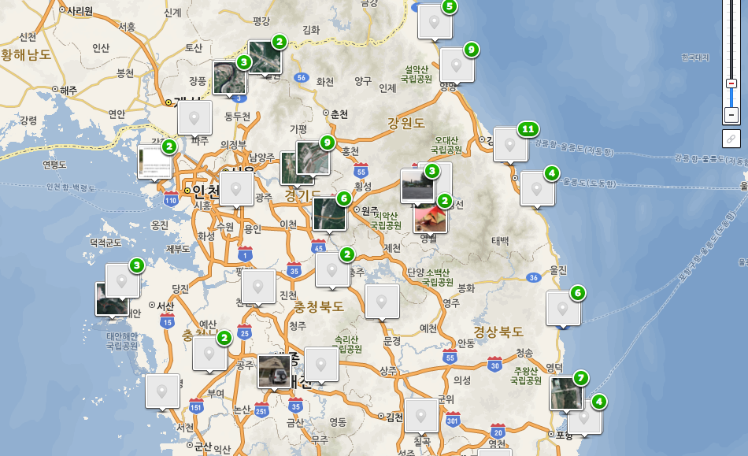

## 나만의 지도 만들기 

------

### 생각의 시작

```
나만의 여행 장소, 맛집, 오지 포인트, 낚시 포인트 등을 기록하고 
지도에 표현하여 어느 위치였는지 한눈에 보고 싶다. 
나만의 지도를 다른 사람과 공유하고 정보를 나누고 싶다.
구글지도는 업체명이 부족하고 네이버지도는 나만의 지도 서비스가 없다. 
네이버지도 API를 활용하여 나만의 지도를 만들어보자. 
```

### 구체적으로..

```
(1) 장소명 검색이나 위/경도 좌표를 입력
(2) 저장 
(3) 공유
```

### 기대효과

```
각종 위치기반 서비스에 응용 
```

### 예 


